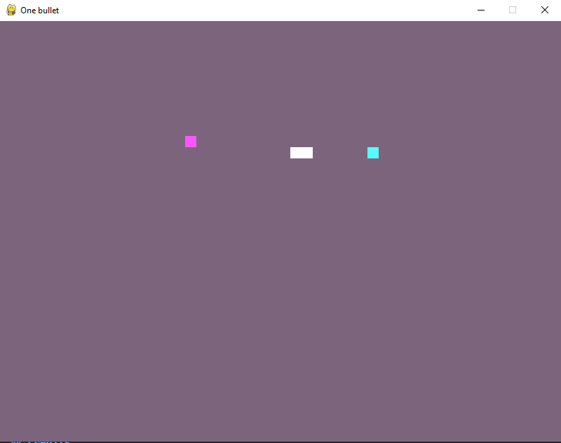

# One Bullet

A python prototype game with the theme "One Bullet".



## Controls

`Player 1`
WASD - Move
J - Shoot

`Player 2`
Arrow keys - Move
Space bar - Shoot

## How to install

1. Clone the repo
```
git clone https://github.com/CaresleGames/one-bullet.git
```

2. Create a python virtual environment and Activate
```
python -m venv venv
```

```bash
# Windows
venv\Scripts\activate
```

3. Install Pygame
```
pip install pygame
```

4. Run the main file
```
python main.py
```

## Credits

Font - [Kenney](https://www.kenney.nl)